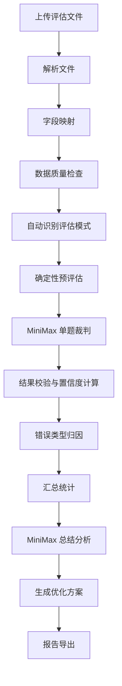

# 问答效果评估系统第一版设计方案

## 1. 第一版目标

建设一个网页版 QA 效果评估系统。用户上传已经生成好的问答测试结果后，系统自动完成：

- 数据解析与字段映射
- 自动识别评估模式
- 逐条 QA 评分
- 错误类型归因
- 汇总统计
- 错误总结
- 优化方案生成
- 导出评估报告

第一版不负责自动调用被测问答系统，只评估已经生成好的问答结果。

## 2. 支持的数据形态

评估集不完整是常态，因此第一版按样本字段自动选择评估模式。

### 2.1 Gold QA 评估

必需字段：

```text
question
actual_answer
gold_answer
```

可评估：

- 答案正确性
- 完整性
- 关键点覆盖
- 遗漏点
- 错误点
- 表达质量

该模式可信度最高，可以统计准确率。

### 2.2 RAG 忠实度评估

必需字段：

```text
question
actual_answer
contexts
```

可评估：

- 上下文忠实度
- 是否幻觉
- 回答是否相关
- 证据是否充分
- 是否遗漏上下文关键点
- 上下文是否存在明显噪声

该模式适合没有标准答案但保留了检索上下文的 RAG 测试结果。

### 2.3 弱监督质量评估

必需字段：

```text
question
actual_answer
```

可评估：

- 问题相关性
- 清晰度
- 逻辑性
- 可用性
- 明显风险
- 是否需要人工复核

该模式不能输出准确率，只输出可用性估计和风险评级。

## 3. 上传文件格式

第一版支持：

- CSV
- XLSX
- JSON
- JSONL

推荐字段：

```text
id
question
actual_answer
gold_answer
contexts
model_name
latency_ms
token_usage
cost
category
```

最低只需要：

```text
question
actual_answer
```

`contexts` 支持三种形式：

- 纯文本
- JSON 数组
- 多段文本用分隔符拼接

示例：

```json
[
  {
    "source": "doc_001",
    "content": "..."
  },
  {
    "source": "doc_002",
    "content": "..."
  }
]
```

## 4. 系统流程



## 5. 评估指标设计

第一版不使用单一总分覆盖所有场景，而是按评估模式分别统计。

### 5.1 Gold QA 指标

| 指标 | 权重 |
| --- | ---: |
| 正确性 correctness | 40 |
| 完整性 completeness | 25 |
| 关键点覆盖 key_point_coverage | 20 |
| 无错误信息 no_contradiction | 10 |
| 表达质量 clarity | 5 |

输出：

```text
gold_score
is_correct
missing_points
wrong_points
```

### 5.2 RAG 忠实度指标

| 指标 | 权重 |
| --- | ---: |
| 上下文忠实度 faithfulness | 35 |
| 回答相关性 relevance | 20 |
| 证据充分性 evidence_support | 20 |
| 幻觉风险 hallucination_risk | 15 |
| 上下文利用率 context_usage | 10 |

输出：

```text
rag_score
is_faithful
unsupported_claims
used_evidence
context_noise
```

### 5.3 弱监督质量指标

| 指标 | 权重 |
| --- | ---: |
| 问题相关性 relevance | 30 |
| 回答可用性 usefulness | 30 |
| 逻辑清晰度 coherence | 20 |
| 风险控制 risk_control | 10 |
| 表达质量 clarity | 10 |

输出：

```text
quality_score
is_usable
risk_level
needs_human_review
```

## 6. 指标统计原则

报告中必须分开统计：

- 有标准答案样本：准确率、平均正确性、平均完整性
- 有上下文样本：忠实率、幻觉风险率、证据不足率
- 仅问答样本：可用率、人工复核率、高风险率

可以提供一个综合分，但名称必须是：

```text
综合质量估计分
```

不能把无标准答案样本混入准确率计算。

## 7. 错误类型体系

第一版固定以下错误类型：

| 错误类型 | 中文说明 |
| --- | --- |
| answer_incorrect | 答案错误 |
| answer_incomplete | 答案不完整 |
| question_misunderstood | 问题理解错误 |
| irrelevant_answer | 答非所问 |
| unsupported_claim | 无依据断言 |
| hallucination | 幻觉 |
| context_not_used | 上下文未使用 |
| insufficient_context | 上下文不足 |
| context_noise | 检索噪声 |
| over_refusal | 过度拒答 |
| format_error | 格式错误 |
| too_vague | 回答过泛 |
| contradiction | 自相矛盾 |
| needs_human_review | 需要人工复核 |

每条样本可以有多个错误类型，但必须有一个主错误类型：

```json
{
  "primary_error_type": "unsupported_claim",
  "error_types": ["unsupported_claim", "too_vague"]
}
```

## 8. MiniMax 裁判设计

MiniMax 负责两类任务：

- 单题裁判：逐条输出结构化评分和错误归因。
- 总结分析：基于统计结果和代表错题生成错误总结与优化方案。

单题裁判使用三套 prompt：

- Gold QA Judge
- RAG Faithfulness Judge
- Weak QA Quality Judge

每套 prompt 都必须要求：

- 只根据输入判断
- 不随意补充外部知识，除非评估配置明确允许
- 给出 0-1 分数
- 给出置信度
- 给出错误类型
- 给出可解释原因
- 标记是否需要人工复核
- 输出严格 JSON

示例输出：

```json
{
  "evaluation_mode": "rag_faithfulness",
  "score": 0.72,
  "confidence": 0.66,
  "is_pass": true,
  "needs_human_review": true,
  "primary_error_type": "unsupported_claim",
  "error_types": ["unsupported_claim", "too_vague"],
  "reason": "回答整体与问题相关，但其中关于适用范围的说法未能在上下文中找到明确依据。",
  "missing_points": [],
  "unsupported_claims": [
    "该方案适用于所有企业场景"
  ],
  "evidence_summary": "上下文支持基础定义，但不支持泛化结论。",
  "suggested_fix": "要求回答必须标明依据来源，缺少依据时使用不确定表达。"
}
```

## 9. 保证评估效果的关键机制

### 9.1 样本级评估模式识别

每条数据独立判断：

```text
有 gold_answer -> Gold QA
无 gold_answer 但有 contexts -> RAG Faithfulness
只有 question + actual_answer -> Weak QA
```

不要将整个文件强行套用同一种模式。

### 9.2 规则预检

调用 MiniMax 前先做确定性检查：

- 空回答
- 极短回答
- 重复乱码
- 回答语言异常
- 明显拒答
- 上下文为空
- gold_answer 为空
- question 为空

这类问题可以直接标记或进入复核队列，避免浪费模型调用。

### 9.3 裁判置信度

每条结果必须包含：

```text
confidence
needs_human_review
```

低置信度条件：

- 没有标准答案
- 没有上下文
- 问题太短
- 回答太泛
- gold_answer 本身不明确
- MiniMax 判断理由不足

低置信度样本不能作为强结论。

### 9.4 双阶段总结

不要让 MiniMax 直接查看全量原始数据后自由总结。推荐流程：

```text
逐条结构化评估
统计错误类型
抽取代表错题
再让 MiniMax 基于统计结果总结
```

这样可以提升总结稳定性。

### 9.5 严重错误标记

严重错误条件：

- score < 0.4
- hallucination
- answer_incorrect
- unsupported_claim 且 confidence > 0.7

报告中优先展示严重错误。

### 9.6 人工复核队列

第一版内置复核队列，自动收集：

- 低置信度样本
- 高风险样本
- 裁判理由过短的样本
- 边界分数样本，例如 0.55 - 0.7

评估系统不能假装 100% 自动准确，需要把不确定样本暴露出来。

## 10. 网页页面设计

### 10.1 上传页

功能：

- 上传文件
- 配置 MiniMax
- 显示支持格式
- 显示最低数据要求

### 10.2 字段映射页

系统自动识别字段，用户确认：

- question 字段
- actual_answer 字段
- gold_answer 字段，可空
- contexts 字段，可空
- category 字段，可空

### 10.3 数据预检页

展示：

- 总样本数
- 可评估样本数
- 缺 question 数
- 缺 actual_answer 数
- Gold QA 样本数
- RAG 样本数
- Weak QA 样本数
- 预计 MiniMax 调用次数

### 10.4 评估进度页

展示：

- 当前进度
- 成功数
- 失败数
- 重试数
- 预计剩余时间

### 10.5 报告总览页

展示：

- 综合质量估计分
- Gold QA 准确率
- RAG 忠实率
- 高风险回答率
- 人工复核率
- 错误类型分布
- 严重错误 Top N

### 10.6 单题明细页

支持筛选：

- 评估模式
- 错误类型
- 分数区间
- 是否需要人工复核
- category

每条展示：

- 问题
- 标准答案
- 模型回答
- 上下文
- 评分
- 错误类型
- 裁判理由
- 优化建议

## 11. 技术架构

推荐第一版：

```text
前端：React + TypeScript
后端：FastAPI
数据库：SQLite 起步，后续可升级 PostgreSQL
任务执行：FastAPI BackgroundTasks 起步，后续可升级 Redis + Celery
文件解析：后端完成
模型调用：后端统一代理 MiniMax
报告导出：Markdown + PDF
```

如果需要更强并发和任务恢复：

```text
前端：React + TypeScript
后端：FastAPI / Node.js
数据库：PostgreSQL
任务队列：Redis + Celery / BullMQ
对象存储：上传文件与报告文件
```

## 12. 核心数据表

### 12.1 evaluation_jobs

```text
id
name
status
file_name
total_count
completed_count
failed_count
created_at
started_at
finished_at
config_json
summary_json
```

### 12.2 evaluation_items

```text
id
job_id
row_index
question
actual_answer
gold_answer
contexts_json
category
evaluation_mode
status
score
confidence
is_pass
needs_human_review
primary_error_type
error_types_json
result_json
created_at
updated_at
```

### 12.3 evaluation_reports

```text
id
job_id
markdown_report
pdf_path
created_at
```

## 13. MiniMax 配置

系统配置项：

```text
api_key
base_url
model
temperature
max_tokens
timeout
retry_count
concurrency
```

建议：

```text
单题裁判 temperature = 0 或 0.1
总结分析 temperature = 0.3
```

单题裁判必须低温，以提升一致性。

## 14. 报告输出结构

导出报告包含：

1. 评估概览
2. 数据完整度说明
3. 各模式样本占比
4. 核心指标
5. 错误类型分布
6. 严重错误样本
7. 高频错误模式总结
8. 根因分析
9. 优化建议
10. 建议补充的评估数据
11. 附录：单题明细

优化建议按优先级输出：

```text
P0：必须立即修复
P1：优先优化
P2：长期改进
```

## 15. 优化方案生成逻辑

MiniMax 总结分析不直接读取全量原始数据，而是接收统计摘要、错误分布和代表样本。

输入示例：

```json
{
  "total": 500,
  "mode_distribution": {
    "gold": 120,
    "rag": 260,
    "weak": 120
  },
  "error_distribution": {
    "unsupported_claim": 82,
    "answer_incomplete": 65,
    "context_not_used": 44
  },
  "worst_cases": [],
  "representative_cases": []
}
```

输出示例：

```json
{
  "summary": "...",
  "root_causes": [],
  "optimization_plan": [
    {
      "priority": "P0",
      "problem": "回答中无依据断言较多",
      "evidence": "unsupported_claim 占错误样本 31%",
      "recommendation": "在 prompt 中强制要求每个关键结论引用上下文；无依据则说明不确定。",
      "expected_impact": "降低幻觉和无依据断言",
      "implementation_difficulty": "medium"
    }
  ]
}
```

## 16. 第一版验收标准

开发完成后按以下标准验收：

- 上传 1000 条 CSV 不崩溃
- 字段映射错误时能提示
- 空回答能被规则识别
- 无标准答案样本不会被算入准确率
- 有上下文样本能输出忠实度和幻觉风险
- 每条评估都有 score、confidence、error_type、reason
- 低置信度样本能进入人工复核列表
- 报告能解释数据完整度
- 优化建议能对应错误统计，不是泛泛而谈
- MiniMax 输出 JSON 异常时能重试或修复

## 17. 推荐开发顺序

1. 文件上传与解析
2. 字段映射
3. 数据预检
4. 评估模式识别
5. 规则预检
6. MiniMax 单题裁判
7. JSON 结果校验与重试
8. 错误统计
9. 报告总览
10. 单题明细
11. MiniMax 总结与优化建议
12. 报告导出

## 18. 第一版定位

第一版应定位为：

```text
弱监督 QA 评估与错误诊断系统
```

它不承诺在缺少标准答案时给出绝对准确率，而是帮助用户识别：

- 哪些回答高风险
- 错在哪里
- 哪些样本需要人工复核
- 应该优先优化检索、prompt、知识库还是生成策略

